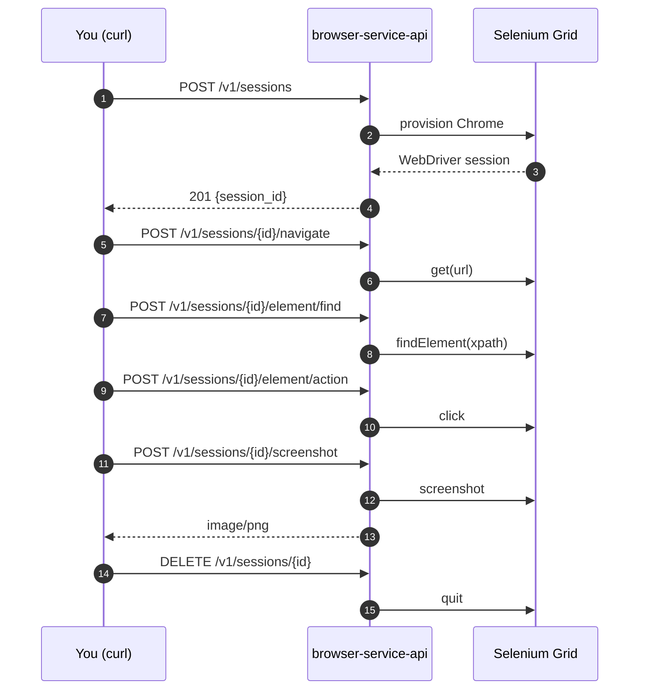

# Browser-Service API — Testing Walkthrough

This guide walks you through running `browser-service-api` locally and exercising
its HTTP and WebSocket surface end-to-end. It is the companion to
[`TESTING.md`](./TESTING.md) (which covers engine unit tests only) and
[`README.md`](./README.md) (which describes the product surface).

If you only want the JUnit suite, run `mvn clean verify` from the repo root and
stop reading.

## Contents

1. [Prerequisites](#1-prerequisites)
2. [Bring up the dependencies](#2-bring-up-the-dependencies)
3. [Start the API](#3-start-the-api)
4. [Smoke test](#4-smoke-test)
5. [Walkthrough: a full session over HTTP](#5-walkthrough-a-full-session-over-http)
6. [One-shot capture](#6-one-shot-capture)
7. [WebSocket walkthrough](#7-websocket-walkthrough)
8. [Browse the spec](#8-browse-the-spec)
9. [Automated tests](#9-automated-tests)
10. [Troubleshooting](#10-troubleshooting)

---

## 1. Prerequisites

| Tool         | Version            | Notes                                                        |
| ------------ | ------------------ | ------------------------------------------------------------ |
| JDK          | 21                 | Temurin / Zulu / Corretto all fine.                          |
| Maven        | wrapped (`./mvnw`) | Or system `mvn` 3.9+.                                        |
| Docker       | recent             | Used for Postgres, Selenium Grid, optionally the API image.  |
| `curl`       | any                | All HTTP examples use it.                                    |
| `jq`         | optional           | For pretty-printing JSON in examples.                        |
| `websocat`   | optional           | Only needed for the WebSocket walkthrough.                   |

The API talks to two upstreams:

- **Postgres** for the session registry (Flyway-managed schema).
- **Selenium Grid** (and optionally Appium) for the actual browser instances.

Both run in Docker containers below.

## 2. Bring up the dependencies

### Postgres

`docker-compose.yml` ships a Postgres on host port **5433** so it does not
collide with anything you already run on `5432`:

```bash
docker compose up -d postgres
```

Verify:

```bash
docker compose ps postgres
docker compose exec postgres pg_isready -U browser_service -d browser_service
```

### Selenium Grid (Chrome)

The default config points at `http://localhost:4444/wd/hub`. The simplest way
to satisfy that is the Selenium standalone image:

```bash
docker run -d --rm --name selenium-chrome \
  -p 4444:4444 -p 7900:7900 \
  --shm-size=2g \
  selenium/standalone-chrome:latest
```

- `4444` — WebDriver hub.
- `7900` — noVNC (open `http://localhost:7900`, password `secret`) so you can
  watch the browser drive itself while you test.

Verify:

```bash
curl -s http://localhost:4444/status | jq .value.ready
# -> true
```

Appium is **not** required unless you want to drive `ANDROID` / `IOS` sessions.
Leave `APPIUM_URLS` unset and stick to `CHROME`.

## 3. Start the API

Pick **one** of these. Option A is the fastest dev loop.

### A. From the repo with Maven (hot path for development)

```bash
./mvnw -pl api spring-boot:run \
  -Dspring-boot.run.arguments="--spring.datasource.url=jdbc:postgresql://localhost:5433/browser_service"
```

The override is needed because `application.yaml` defaults to `5432`, but
docker-compose maps Postgres to `5433`.

### B. Built jar

```bash
./mvnw -pl api -am -DskipTests package
DATABASE_URL=jdbc:postgresql://localhost:5433/browser_service \
java -jar api/target/browser-service-api-*-exec.jar
```

### C. Full docker-compose (api + postgres in containers)

```bash
docker compose up -d --build
```

This exposes the API on **host port 9999** (mapped to container `8080`). Every
example below assumes the local-Maven setup on `:8080` — substitute `:9999` if
you go this route. Note that the containerised API will resolve
`http://localhost:4444` from inside the container, not the host, so you will
also need to either run Selenium in the same compose network or pass
`-e SELENIUM_GRID_URLS=http://host.docker.internal:4444/wd/hub`.

### Pick a caller ID

Every `/v1/...` request must carry an `X-Caller-Id` header. Pick anything
printable; `me` is fine for local work.

```bash
export CALLER=me
```

## 4. Smoke test

Liveness:

```bash
curl -s http://localhost:8080/healthz | jq
# -> { "status": "ok" }
```

Readiness (this also probes Selenium / Postgres):

```bash
curl -s http://localhost:8080/readyz | jq
```

A `200` with `"status": "ready"` means the API can reach Postgres **and** the
Selenium hub. A `503` body shows which dependency is unhappy — fix that before
moving on.

Caller-ID guard:

```bash
curl -s -o /dev/null -w "%{http_code}\n" http://localhost:8080/v1/sessions
# -> 400  (caller_unidentified)
```

## 5. Walkthrough: a full session over HTTP

This mirrors the example in the README but with the assumption that the
service is on `localhost:8080`.



### 5.1 Open a session

```bash
SESSION=$(curl -s -X POST http://localhost:8080/v1/sessions \
  -H "X-Caller-Id: $CALLER" \
  -H 'Content-Type: application/json' \
  -d '{"browser_type":"CHROME","environment":"TEST"}' \
  | jq -r .session_id)
echo "$SESSION"
```

`browser_type` accepts `CHROME`, `FIREFOX`, `SAFARI`, `IE`, `ANDROID`, `IOS`.
`environment` accepts `TEST` or `DISCOVERY`. Field names are snake_case
(Jackson is configured globally that way).

If you opened the noVNC window in step 2, you should now see a fresh Chrome.

### 5.2 Navigate

```bash
curl -s -X POST "http://localhost:8080/v1/sessions/$SESSION/navigate" \
  -H "X-Caller-Id: $CALLER" \
  -H 'Content-Type: application/json' \
  -d '{"url":"https://example.com"}' | jq
```

### 5.3 Find an element

```bash
HANDLE=$(curl -s -X POST "http://localhost:8080/v1/sessions/$SESSION/element/find" \
  -H "X-Caller-Id: $CALLER" \
  -H 'Content-Type: application/json' \
  -d '{"xpath":"//a"}' \
  | jq -r .element_handle)
echo "$HANDLE"
```

The response also reports `found`, `displayed`, attributes, etc. — the full
shape is `ElementStateResponse`.

### 5.4 Act on the element

`action` accepts: `CLICK`, `DOUBLE_CLICK`, `HOVER`, `CLICK_AND_HOLD`,
`CONTEXT_CLICK`, `RELEASE`, `SEND_KEYS`, `MOUSE_OVER`. `SEND_KEYS` reads from
the optional `input` field.

```bash
curl -s -o /dev/null -w "%{http_code}\n" \
  -X POST "http://localhost:8080/v1/sessions/$SESSION/element/action" \
  -H "X-Caller-Id: $CALLER" \
  -H 'Content-Type: application/json' \
  -d "{\"element_handle\":\"$HANDLE\",\"action\":\"CLICK\"}"
# -> 204
```

### 5.5 Screenshot

Binary (default):

```bash
curl -s -X POST "http://localhost:8080/v1/sessions/$SESSION/screenshot" \
  -H "X-Caller-Id: $CALLER" \
  -H 'Content-Type: application/json' \
  -d '{"strategy":"VIEWPORT"}' \
  --output /tmp/page.png
open /tmp/page.png   # macOS; use xdg-open on Linux
```

Strategies: `VIEWPORT`, `FULL_PAGE_SHUTTERBUG`, `FULL_PAGE_ASHOT`,
`FULL_PAGE_SHUTTERBUG_PAUSED`.

Base64 (for MCP / non-binary callers):

```bash
curl -s -X POST "http://localhost:8080/v1/sessions/$SESSION/screenshot" \
  -H "X-Caller-Id: $CALLER" \
  -H 'Content-Type: application/json' \
  -d '{"strategy":"VIEWPORT","encoding":"BASE64"}' | jq -r .png_base64 | head -c 80
```

### 5.6 Other useful endpoints

```bash
# Page status (URL + 503 detection)
curl -s "http://localhost:8080/v1/sessions/$SESSION/status" -H "X-Caller-Id: $CALLER" | jq

# Viewport size + scroll offset
curl -s "http://localhost:8080/v1/sessions/$SESSION/viewport" -H "X-Caller-Id: $CALLER" | jq

# Full HTML source
curl -s "http://localhost:8080/v1/sessions/$SESSION/source" -H "X-Caller-Id: $CALLER" | jq -r .html | head -20

# Scroll
curl -s -X POST "http://localhost:8080/v1/sessions/$SESSION/scroll" \
  -H "X-Caller-Id: $CALLER" -H 'Content-Type: application/json' \
  -d '{"mode":"BOTTOM"}'

# Execute arbitrary JS (escape hatch, no engine method behind it)
curl -s -X POST "http://localhost:8080/v1/sessions/$SESSION/execute" \
  -H "X-Caller-Id: $CALLER" -H 'Content-Type: application/json' \
  -d '{"script":"return document.title;"}' | jq
```

Full path-to-engine map lives in [`README.md` § Engine → endpoint map](./README.md#engine--endpoint-map-for-the-coverage-walk).

### 5.7 List & describe

```bash
curl -s http://localhost:8080/v1/sessions \
  -H "X-Caller-Id: $CALLER" | jq

curl -s "http://localhost:8080/v1/sessions/$SESSION" \
  -H "X-Caller-Id: $CALLER" | jq
```

Sessions are scoped per caller — two different `X-Caller-Id` values cannot
see each other's sessions.

### 5.8 Close

```bash
curl -s -o /dev/null -w "%{http_code}\n" \
  -X DELETE "http://localhost:8080/v1/sessions/$SESSION" \
  -H "X-Caller-Id: $CALLER"
# -> 204
```

A subsequent `GET /v1/sessions/$SESSION` now returns `404 session_not_found`.
After idle / absolute TTL expiry the same call returns `410 session_expired`.

## 6. One-shot capture

For "open → navigate → screenshot → close" in a single request:

```bash
curl -s -X POST http://localhost:8080/v1/capture \
  -H "X-Caller-Id: $CALLER" \
  -H 'Content-Type: application/json' \
  -d '{
    "url":"https://example.com",
    "browser_type":"CHROME",
    "environment":"TEST",
    "strategy":"VIEWPORT",
    "encoding":"BINARY"
  }' | jq
```

With `encoding: "BINARY"` the response carries an `href` you can `GET` to
download the PNG bytes:

```bash
curl -s "http://localhost:8080/v1/capture/<capture_id>/screenshot" \
  -H "X-Caller-Id: $CALLER" --output /tmp/capture.png
```

With `encoding: "BASE64"` the bytes are inlined in the JSON.

## 7. WebSocket walkthrough

The WebSocket is the primary interaction channel for stateful, multi-step
flows. URL: `ws://localhost:8080/v1/ws/sessions`. The handshake requires the
same `X-Caller-Id` header.

Frames are JSON of shape:

```json
{ "type": "command", "id": "<correlation-id>", "op": "<op-name>", "params": { ... } }
```

The server replies with `{"type":"response","id":...,"ok":true,"result":...}`
or `{...,"ok":false,"error":{...}}`. Screenshot ops return a JSON header
followed by a binary PNG frame.

Available ops (mirrors the REST surface): `session.create`, `session.attach`,
`session.describe`, `session.close`, `navigation.navigate`,
`navigation.source`, `navigation.status`, `screenshot.page`,
`screenshot.element`, `capture.run`, `capture.fetchScreenshot`, `alert.state`,
`alert.respond`, `script.execute`, `mouse.move`, `element.find`,
`element.action`, `touch.tap`, `scroll.to`, `viewport.state`, `dom.remove`.

### Quick smoke test with `websocat`

```bash
websocat -H 'X-Caller-Id: me' ws://localhost:8080/v1/ws/sessions
```

Then paste:

```json
{"type":"command","id":"1","op":"session.create","params":{"browser_type":"CHROME","environment":"TEST"}}
{"type":"command","id":"2","op":"navigation.navigate","params":{"url":"https://example.com"}}
{"type":"command","id":"3","op":"viewport.state","params":{}}
{"type":"command","id":"4","op":"session.close","params":{}}
```

After `session.create` the connection is bound to the new session — subsequent
ops do not need to repeat the `session_id`. To reuse an existing session
opened over HTTP, send `session.attach` with `{"session_id":"<uuid>"}` first.

## 8. Browse the spec

While the API is running:

- **Swagger UI** — <http://localhost:8080/swagger-ui.html>
- **Raw OpenAPI** — <http://localhost:8080/v3/api-docs>
- **Static, generated copy** — [`openapi/generated.yaml`](./openapi/generated.yaml)
  (regenerate with `mvn test -pl api -Dtest=SpecExportTest -Dopenapi.update=true`).

Lint the static spec:

```bash
npx @redocly/cli lint openapi/generated.yaml
```

## 9. Automated tests

```bash
# Everything (engine + api). Includes SpecExportTest, which fails if the
# committed openapi/generated.yaml is out of sync with the controllers.
./mvnw clean verify

# API module only
./mvnw -pl api -am test

# Engine module only — see TESTING.md
./mvnw -pl engine test

# A single class
./mvnw -pl api test -Dtest=SessionsControllerTest

# Coverage HTML for the api module
open api/target/site/jacoco/index.html
```

## 10. Troubleshooting

| Symptom | Likely cause | Fix |
|---|---|---|
| `400 caller_unidentified` | Missing or blank `X-Caller-Id` | Add the header. |
| `403 session_forbidden` | Different caller is hitting another caller's session | Use the same `X-Caller-Id` that created the session. |
| `404 session_not_found` | Session was closed or never existed | Open a new one. |
| `410 session_expired` | Idle (5 min) or absolute (30 min) TTL fired | Open a new one. |
| `429 session_cap_exceeded` | More than 20 concurrent sessions for this caller (see `application.yaml`) | Close some. |
| `502 upstream_unavailable` on `POST /v1/sessions` | Selenium hub not reachable | `curl http://localhost:4444/status`; check the `selenium-chrome` container. |
| `readyz` returns 503 | Postgres or Selenium probe failed | Inspect the JSON body — it names the failing dependency. |
| App fails to boot with `password authentication failed` / `Connection refused` on `:5432` | Postgres is on host `:5433` from compose, but the app's default is `:5432` | Pass `--spring.datasource.url=jdbc:postgresql://localhost:5433/browser_service` (see § 3.A). |
| WebSocket handshake closed immediately | Missing `X-Caller-Id` header on the upgrade | Pass it via `-H` to `websocat`. |

To watch what the browser is actually doing, leave the noVNC tab from § 2
open at `http://localhost:7900` while you run the requests.
