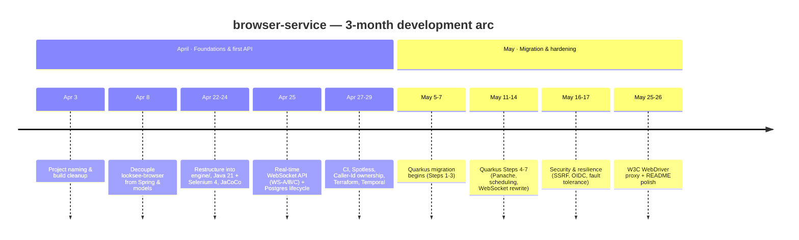

# Daily Accomplishment Summary

A day-by-day log of what was accomplished in `browser-service`, generated from
the commit history.

- **Window:** 2026-03-18 → 2026-06-18 (last 3 months)
- **Active days:** 20
- **Commits:** 53

> The repository's history begins on 2026-04-03, so the first ~2 weeks of the
> window predate the project. There is no activity after 2026-05-26.

## Timeline

## April 2026 — Foundations & first API surface

### Thu, Apr 3 — Project naming & build cleanup
- Reworked project naming conventions (PascalCase, dropped Looksee/LookSee
  prefixes, then re-added the `A11y` prefix to LookseeCore artifacts).
- Fixed build failures from the artifactId churn and a failing `CssUtilsTest`
  (non-null `w3c_document` assertion). *(5 commits)*

### Wed, Apr 8 — Decoupling `looksee-browser`
- Removed Spring compile-time dependencies from `looksee-browser`.
- Decoupled it from the `com.looksee.models` package and renamed
  `com.looksee.browsing.*` → `com.looksee.browser.*`. *(3 commits)*

### Wed, Apr 22 — Restructure into a service
- Restructured the codebase into an `engine/` module and added the initial API
  design artifacts. *(1 commit)*

### Thu, Apr 23 — Engine stands up as a standalone project
- Converted the POM to a standalone project; bumped to Java 21 / Selenium 4 /
  Appium 9.
- Removed obsolete files, refreshed the README, updated dependencies, and
  introduced the browser service engine + API design. *(4 commits)*

### Fri, Apr 24 — Hardening the API
- Added JaCoCo coverage integration and improved error handling. *(1 commit)*

### Fri, Apr 25 — Real-time WebSocket surface *(busiest day, 8 commits)*
- Documented the core goal: stateful sessions over a real-time socket.
- **WS-A:** WebSocket command/response surface (#6).
- **WS-B:** server-pushed events — alerts, console/browser logs, navigation.
- **WS-C:** binary frames for screenshots and captures.
- Fixed WS decorator buffer ordering and attach-bind ordering (review feedback).
- Added Postgres tracking for the browser session lifecycle. *(incl. 2 PR merges)*

### Mon, Apr 27 — CI, formatting & Caller-Id groundwork
- Wired Spotless with Google Java Format (#27).
- Added GitHub Actions workflow + Maven wrapper (#33, #34).
- Made `SessionHandle.touch()` package-private.
- **Caller-Id 1/5:** plumbing — `CallerId`, exceptions, argument resolver,
  OpenAPI customizer. *(4 commits)*

### Tue, Apr 28 — Caller-Id ownership + infra
- **Caller-Id 2/5 + 3/5:** domain `owner` + controllers now require
  `X-Caller-Id`.
- **Caller-Id 4/5:** dropped `WsSessionOwnership` so `SessionHandle.owner` is the
  single source of truth.
- Added a Terraform GCP module to stand up browser-service + the Selenium fleet.
  *(3 commits)*

### Wed, Apr 29 — Wrapping up two feature tracks
- **Caller-Id 5/5:** surfaced owner in DTOs, reaper log, and docs.
- **Temporal 3/3:** surfaced the temporal contract via DTOs, with reason logging
  and metrics. *(2 commits)*

## May 2026 — Quarkus migration, security hardening & W3C proxy

### Mon, May 5 — Local dev quality-of-life
- Changed the PostgreSQL port mapping to avoid conflicts and added an API testing
  walkthrough for local setup. *(2 commits)*

### Tue, May 6 — Quarkus migration begins
- **Step 1 (WIP):** swapped the Spring Boot BOM/plugin for Quarkus 3.15.7 (#14).
- Made the engine honor configured Selenium URLs in all environments and
  re-enabled `SeleniumGridIT`.
- Refreshed the README with badges, hero, and Mermaid diagrams. *(3 commits)*

### Wed, May 7 — Quarkus migration Steps 1–3
- Closed out Step 1 wiring, landed Step 2 (application config), and Step 3
  (controller verification). *(3 commits)*

### Mon, May 11 — Compose stack
- Bundled Selenium standalone-chrome alongside Postgres + API in Docker Compose.
  *(1 commit)*

### Tue, May 12 — Quarkus migration Steps 4–5
- **Step 4:** Spring DI bean-wiring smoke test.
- **Step 5:** switched persistence to Panache. *(2 commits)*

### Wed, May 13 — Quarkus migration Step 6 + regression fixes
- **Step 6:** scheduling verification.
- Added a `%dev` H2 fallback with Step 3 smoke findings.
- Fixed the eight Quarkus controller-layer regressions (F1–F8). *(3 commits)*

### Thu, May 14 — Quarkus migration Step 7
- Rewrote the WebSocket layer to `quarkus-websockets-next`. *(1 commit)*

### Fri, May 16 — Security: SSRF
- **S2:** added an SSRF guard on navigate and capture (#90). *(1 commit)*

### Sun, May 17 — Security & resilience *(3 commits)*
- **R1:** fault tolerance on WebDriver calls (#110).
- **S1:** replaced `X-Caller-Id` trust with OIDC JWT bearer auth (#89).
- **R10 Phase 0:** pinned `SessionRegistry` to a single Cloud Run pod (#119).

### Sun, May 25 — Client compatibility
- Added a W3C WebDriver protocol proxy so standard `RemoteWebDriver` clients can
  connect (#150). *(1 commit)*

### Mon, May 26 — Docs polish
- Removed emoji decorations and reorganized the README structure. *(1 commit)*

## The arc of the quarter

The project went from **extracting and renaming a browser engine** (early April)
→ **building a real-time WebSocket session API with Postgres lifecycle
tracking** (late April) → **adding caller identity/ownership and GCP/Terraform
infra** → a **multi-step Quarkus migration off Spring Boot** (early–mid May) →
**security & resilience hardening** (OIDC auth, SSRF guard, fault tolerance) → a
**W3C WebDriver proxy** for standard client compatibility (late May).
