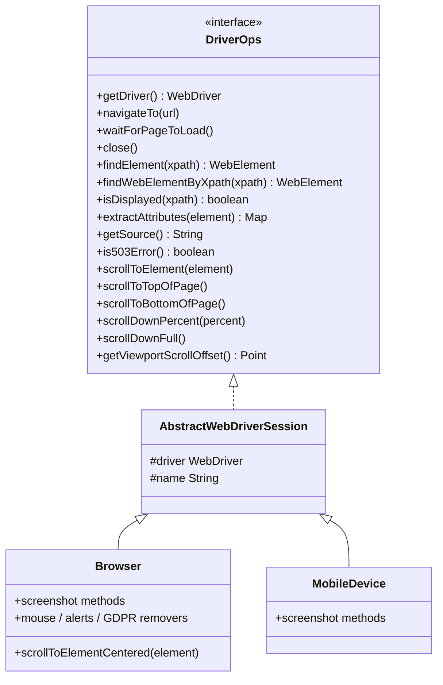

# Design: Unify Browser + MobileDevice behind DriverOps

**Issue:** [#154](https://github.com/brandonkindred/browser-service/issues/154)  
**Date:** 2026-07-17  
**Status:** Approved for implementation planning

## Problem

`Browser` (~572 LOC) and `MobileDevice` (~421 LOC) duplicate navigate, find, scroll, source, viewport, attributes, and close logic. API services re-branch with `isMobile()` / `asBrowser()` / `asMobileDevice()` for those shared operations (~60+ call sites).

## Goals

- One shared contract and implementation for DOM/nav/scroll/source/attributes/close
- API services call `SessionHandle.ops()` for shared work
- Keep public REST/WS contracts unchanged
- Screenshots and input stacks stay divergent (explicit branching)

## Non-goals

- Screenshot decode/re-encode cleanup ([#155](https://github.com/brandonkindred/browser-service/issues/155))
- Fault-tolerance / `SeleniumGuard` consolidation ([#156](https://github.com/brandonkindred/browser-service/issues/156))
- Purging unused engine types ([#157](https://github.com/brandonkindred/browser-service/issues/157))
- Redis-backed session registry
- Changing full-page stitch strategies

## Decisions

| Decision | Choice |
|----------|--------|
| Structure | `DriverOps` interface + `AbstractWebDriverSession` base class; `Browser` / `MobileDevice` subclass it |
| Screenshots | **Not** on `DriverOps`; services keep `asBrowser()` / `asMobileDevice()` for screenshot paths |
| Divergent accessors | Keep `asBrowser()` / `asMobileDevice()` / `isMobile()` for screenshots, ActionFactory vs MobileActionFactory, desktop-only APIs |

## Architecture



### Package ownership

All new types live in `engine` under `com.looksee.browser`:

- `DriverOps.java` — interface
- `AbstractWebDriverSession.java` — shared method bodies and JS helpers/constants

`Browser` and `MobileDevice` become subclasses; constructors and factories stay as today (return concrete types).

### SessionHandle

```java
public DriverOps ops() {
  return mobileDevice != null ? mobileDevice : browser;
}

public WebDriver driver() {
  return ops().getDriver();
}
```

`closeOnce()` closes via `ops().close()` (same try/catch logging as today).

`asBrowser()`, `asMobileDevice()`, and `isMobile()` remain unchanged.

## DriverOps surface (normative)

Shared methods that **must** move into `AbstractWebDriverSession` (single implementation):

- `getDriver()`
- `navigateTo(String url)`
- `waitForPageToLoad()`
- `close()`
- `findWebElementByXpath(String xpath)`
- `findElement(String xpath)`
- `isDisplayed(String xpath)`
- `extractAttributes(WebElement element)` (+ private `loadAttributes`)
- `getSource()`
- `is503Error()`
- `scrollToElement(WebElement element)` — the `scrollIntoView` overload only
- `scrollToTopOfPage()`, `scrollToBottomOfPage()`, `scrollDownPercent(double)`, `scrollDownFull()`
- `getViewportScrollOffset()`
- Shared viewport JS helpers (`extractViewportWidth` / `Height`, etc.)

Also move onto the abstract base (available on both types, but **not** required on the `DriverOps` interface unless useful for tests):

- `removeElement(String className)` — already duplicated; Drift/GDPR removers stay on `Browser` only

**Explicitly not on `DriverOps`:**

- All screenshot methods
- `scrollToElement(String xpath, WebElement elem)` busy-loop overload (Browser-only; leave on `Browser` for now — do not expand its use)
- `scrollToElementCentered(WebElement)` — Browser-only
- Mouse / alert APIs — Browser-only
- Drift / GDPR removers — Browser-only

## Service migration

### Use `h.ops()`

| Service | Methods |
|---------|---------|
| `BrowserOperationsService` | navigate + wait, getSource, getViewportScrollOffset, `performScroll` for shared scroll modes |
| `ElementOperationsService` | findElement, extractAttributes |
| `CaptureService` | navigate + wait, getSource, findElement, extractAttributes |
| `SessionService` | getViewportScrollOffset |

### Keep branching / concrete types

| Path | Reason |
|------|--------|
| `renderPageScreenshot` / element screenshots | Screenshots off `DriverOps` |
| `ActionFactory` vs `MobileActionFactory` | Different input stacks |
| `removeDom`, `moveMouse` | Desktop-only after `isMobile` guard → `asBrowser()` |
| `ScrollMode.TO_ELEMENT_CENTERED` | Desktop: `asBrowser().scrollToElementCentered`; mobile: `ops().scrollToElement` |
| Session create (`browserType.isMobile()`) | Factory selection |

## Error handling

No new exception types. Shared methods preserve existing behavior (including swallow-on-close / navigate catch patterns currently in `Browser` / `MobileDevice`). Services keep existing `ApiException` mapping.

## Testing

1. Unit tests for `AbstractWebDriverSession` with a mock `WebDriver` covering navigate, find, scroll, source, attributes, close.
2. Keep `BrowserTest` / `MobileDeviceTest` focused on subclass-specific behavior (screenshots; desktop mouse/alerts where covered).
3. Update `SessionHandleTest` for `ops()` and `driver()` / `closeOnce` via ops.
4. Update service unit tests that stub shared ops through `asBrowser`/`asMobileDevice` to use `ops()` where practical.
5. Run full `engine` + `api` test suites. No OpenAPI schema changes.

## Rollout

Single implementation PR preferred (engine abstraction + `SessionHandle.ops()` + service migration + tests). Split only if review size becomes unwieldy (engine types first, then API migration).

## Acceptance criteria (from #154)

- [ ] Shared `DriverOps` covers navigate, wait-for-load, find, source, viewport offset, scroll (shared modes), attributes, close
- [ ] `Browser` / `MobileDevice` no longer duplicate those method bodies
- [ ] API services use `SessionHandle.ops()` for shared ops; mobile/desktop branching only where behavior truly differs
- [ ] Existing unit/integration tests updated and green
- [ ] No intentional REST/WS API contract changes
