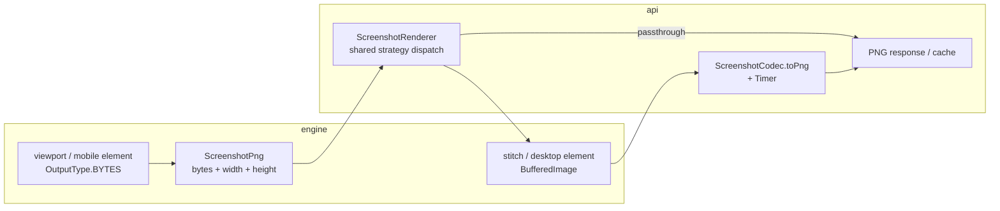

# Design: Stop decode → re-encode on the screenshot hot path

**Issue:** [#155](https://github.com/brandonkindred/browser-service/issues/155)  
**Date:** 2026-07-20  
**Status:** Approved for implementation planning

## Problem

Viewport screenshots currently go `OutputType.FILE` → `ImageIO.read` → PNG re-encode via `ScreenshotCodec`. Controllers/services often `ImageIO.read` the PNG again solely for width/height. `renderPageScreenshot` is duplicated between `BrowserOperationsService` and `CaptureService`.

## Goals

- Prefer `OutputType.BYTES` for viewport and mobile element shots when the wire format is already PNG
- Carry dimensions with the PNG payload so callers do not re-decode for width/height
- Extract one shared render helper used by REST screenshot + capture flows
- Add Micrometer timing around encode/passthrough so the improvement is observable
- Keep full-page AShot/Shutterbug (and desktop element Shutterbug) paths working

## Non-goals

- Changing public screenshot strategy enums/REST contracts unless required
- Extending `SeleniumGuard` to Capture ([#156](https://github.com/brandonkindred/browser-service/issues/156))
- Putting screenshots on `DriverOps` ([#154](https://github.com/brandonkindred/browser-service/issues/154))
- Optimizing stitch paths beyond “dims from `BufferedImage` before encode” (no FILE→BYTES change for AShot/Shutterbug)

## Decisions

| Decision | Choice |
|----------|--------|
| Approach | Engine owns `ScreenshotPng`; API owns shared render + Micrometer |
| Viewport / mobile element return type | `ScreenshotPng` (`bytes` + `width` + `height`) |
| Stitch / desktop element | Stay `BufferedImage` → `ScreenshotCodec.toPng` |
| Dimensions | Prefer PNG IHDR parse; fallback one-shot decode only if header invalid |
| Micrometer | Timer `screenshot.encode` with `path=passthrough\|reencode` |
| Mobile full-page strategies | Map to viewport passthrough (no decode→reencode) |

## Architecture

Screenshots remain off `DriverOps`. Services keep `asBrowser()` / `asMobileDevice()` for screenshot branching.

## Components

### Engine (`com.looksee.browser`)

| Type / method | Role |
|---|---|
| `ScreenshotPng` | Immutable record: `byte[] png()`, `int width()`, `int height()` |
| `PngDimensions` | Parse width/height from PNG IHDR without full bitmap decode; fallback `ImageIO.read` only if IHDR invalid |
| `Browser.getViewportScreenshot()` | Return `ScreenshotPng` via `OutputType.BYTES` |
| `MobileDevice.getViewportScreenshot()` | Same |
| `MobileDevice.getElementScreenshot(WebElement)` | Same → `ScreenshotPng` |
| `Browser` stitch + desktop element | Unchanged (`BufferedImage`) |
| `MobileDevice.getFullPageScreenshot()` | Prefer not forcing a decode; API maps mobile full-page strategies to viewport passthrough |

### API

| Type | Role |
|---|---|
| `ScreenshotRenderer` | Single `render(SessionHandle, ScreenshotStrategy) → ScreenshotPng` used by `BrowserOperationsService` and `CaptureService`. Reuses the engine `ScreenshotPng` type for both passthrough and post-encode results (no separate API DTO). |
| `ScreenshotCodec.toPng` | Unchanged semantics; timed as `path=reencode`; caller wraps encoded bytes with dims from the source `BufferedImage` into `ScreenshotPng` |
| Passthrough branch | Timed as `path=passthrough` (documents the hot path) |
| Controllers / capture refs | Consume dims from `ScreenshotPng`; delete local `readDimensions(byte[])` helpers |

### Method migration

- Change viewport (and mobile element) return types from `BufferedImage` to `ScreenshotPng` at the engine boundary (internal API only; not a public REST change).
- Delete duplicated private `renderPageScreenshot` / `readDimensions` in services and `ScreenshotsController`.
- `ElementOperationsService`: mobile element uses `ScreenshotPng` passthrough; desktop element still encodes Shutterbug `BufferedImage`.

## Data flow

### Viewport / mobile element (hot path)

1. Selenium `getScreenshotAs(OutputType.BYTES)` → PNG bytes
2. `PngDimensions` from IHDR → `ScreenshotPng`
3. `ScreenshotRenderer` returns bytes + dims unchanged (no `ImageIO`, no `toPng`)
4. Controller / capture cache uses dims from the result

### Stitch / desktop element

1. Engine returns `BufferedImage`
2. Dims from `image.getWidth()` / `getHeight()`
3. `ScreenshotCodec.toPng` under Micrometer timer (`path=reencode`)
4. Same response / cache shape as today

### Mobile full-page strategies

`FULL_PAGE_SHUTTERBUG`, `FULL_PAGE_ASHOT`, and `FULL_PAGE_SHUTTERBUG_PAUSED` on mobile already fall back to viewport; route them through the viewport `ScreenshotPng` passthrough path so they do not decode solely to re-encode.

## Error handling

- Null or empty Selenium bytes → upstream-unavailable style (same intent as null `BufferedImage` today)
- IHDR parse failure → one-shot `ImageIO.read` for dimensions only; if that fails, use `{0, 0}` for API responses that already tolerate missing dims (base64 JSON / capture ref); do not fail the capture
- Encode failures remain `ScreenshotEncodingFailedException`
- No new public REST error codes

## Metrics

- Meter name: `screenshot.encode`
- Type: `Timer`
- Tag: `path=passthrough` | `path=reencode`
- Registered where encode/passthrough is decided (`ScreenshotRenderer` / codec call site), consistent with existing `MeterRegistry` injection patterns (`UrlSafetyValidator`, `SessionReaper`)

## Testing

1. Unit tests for `PngDimensions` / `ScreenshotPng` construction from a minimal PNG fixture
2. Engine tests: viewport / mobile element mock `OutputType.BYTES` instead of `FILE`
3. API: `ScreenshotRenderer` covers viewport passthrough vs stitch encode; service tests stub `ScreenshotPng`
4. Micrometer: assert `screenshot.encode` timer records with the expected `path` tag
5. Full `engine` + `api` suites green; no OpenAPI schema changes

## Rollout

Single implementation PR (engine types + API renderer + call-site migration + tests + metrics). Split only if review size becomes unwieldy (engine `ScreenshotPng` first, then API consolidation).

## Acceptance criteria (from #155)

- [ ] Hot viewport path does not FILE → decode → re-encode when unnecessary
- [ ] Dimension helpers do not re-decode PNG when dimensions are already known
- [ ] Single shared render/dimensions utility used by screenshot + capture paths
- [ ] Existing screenshot/capture tests updated and green
- [ ] Micrometer timing around screenshot encode/passthrough to show improvement
