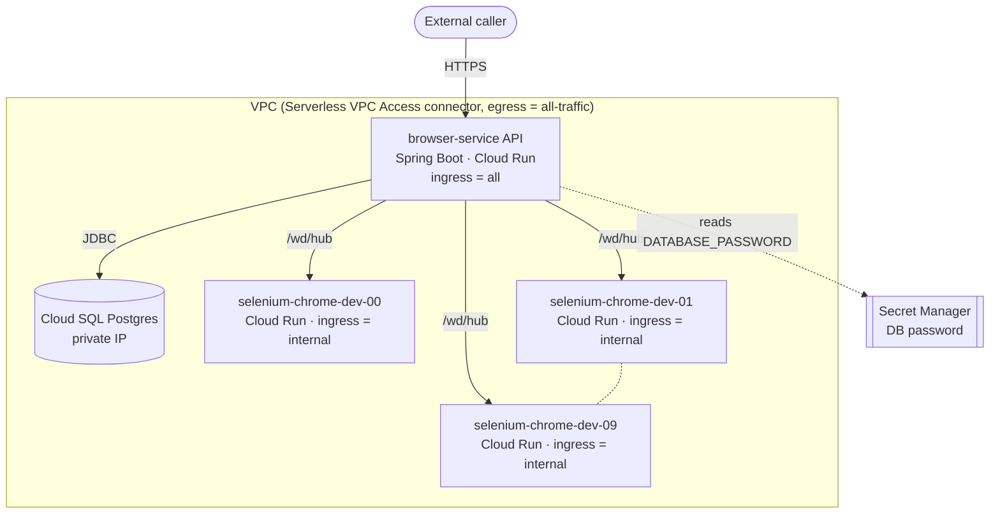

# Terraform — GCP deployment for browser-service

This module provisions a complete browser-service environment on Google Cloud:

- **VPC** with a primary subnet, Serverless VPC Access connector, and private services access for Cloud SQL.
- **Cloud SQL Postgres** (private IP only) plus a Secret Manager secret holding the generated password.
- **Cloud Run × N** Selenium standalone-chrome replicas, modeled on [`LookseeIaC/GCP/modules/selenium`](https://github.com/brandonkindred/LookseeIaC/tree/main/GCP/modules/selenium).
- **Cloud Run** browser-service Spring Boot API, wired to Postgres and to all Selenium replicas via `SELENIUM_GRID_URLS`.

A single `terraform apply` brings the whole stack up: Postgres, the API, and 10 Selenium browser containers (configurable via `selenium_instance_count`).

## Layout

```
terraform/
├── main.tf                          # Wires modules + enables APIs + creates the runtime service account.
├── variables.tf                     # Top-level input variables.
├── outputs.tf                       # API URL, grid URLs, DB info.
├── providers.tf
├── versions.tf
├── terraform.tfvars.example
└── modules/
    ├── vpc/                         # Network, subnet, VPC connector, private services access.
    ├── postgres/                    # Cloud SQL Postgres (private IP) + DB password in Secret Manager.
    ├── selenium/                    # One Cloud Run service per Selenium replica (LookseeIaC-shaped).
    └── browser_service/             # Cloud Run service for the Spring Boot API.
```

## Prerequisites

1. A GCP project with billing enabled.
2. `gcloud auth application-default login` (or set `credentials_file` to a service account JSON).
3. The principal running `terraform apply` needs at minimum: `roles/owner`, or a tighter combo of:
   - `roles/serviceusage.serviceUsageAdmin`
   - `roles/compute.networkAdmin`
   - `roles/vpcaccess.admin`
   - `roles/cloudsql.admin`
   - `roles/secretmanager.admin`
   - `roles/run.admin`
   - `roles/iam.serviceAccountAdmin`
   - `roles/iam.securityAdmin`
4. A published browser-service container image — Artifact Registry, GHCR, or Docker Hub all work. Set `browser_service_image` to its pullable reference.

## Usage

```bash
cd terraform
cp terraform.tfvars.example terraform.tfvars
$EDITOR terraform.tfvars         # set project_id, image, etc.

terraform init
terraform plan
terraform apply
```

When `apply` finishes:

```bash
terraform output browser_service_url
# https://browser-service-api-dev-xxxxx-uc.a.run.app

curl "$(terraform output -raw browser_service_url)/v1/sessions" \
  -H 'Content-Type: application/json' \
  -d '{"browser":"chrome","environment":"discovery"}'
```

## How the pieces connect



- The API reads `DATABASE_PASSWORD` from Secret Manager; everything else (`DATABASE_URL`, `DATABASE_USERNAME`, `SELENIUM_GRID_URLS`) is plain env injected by Terraform.
- Selenium services run with `ingress = "internal"` so they're only reachable from the VPC (the browser-service runs through the VPC connector, so it can hit them).
- The API runs with `ingress = "all"` by default. Flip `browser_service_allow_public = false` to drop the `allUsers` invoker binding once you have auth wired up.

## Variables you'll most likely change

| Variable | Default | Notes |
|---|---|---|
| `project_id` | — | Required. |
| `region` | `us-central1` | Cloud Run + Cloud SQL region. |
| `environment` | `dev` | Suffixed onto resource names. |
| `browser_service_image` | `ghcr.io/brandonkindred/browser-service:latest` | Pull spec for the API container. |
| `selenium_instance_count` | `10` | Number of Selenium Cloud Run replicas. |
| `selenium_image` | `selenium/standalone-chrome:4.27.0` | Override to match LookseeIaC's pinned `3.141.59` if you need legacy parity. |
| `postgres_tier` | `db-custom-1-3840` | Bump for prod. |
| `postgres_deletion_protection` | `true` | Set `false` in dev so `terraform destroy` works. |

See `variables.tf` for the full list (autoscaling bounds, CPU/memory allocations, ingress, etc.).

## Cost guardrails

The default footprint isn't free:

- 1 Cloud SQL Postgres `db-custom-1-3840` instance (~$50/mo idle).
- 10 Cloud Run Selenium services with `min_instances = 1` (each holds one warm Chrome container).
- 1 Cloud Run browser-service API with `min_instances = 1`.
- 1 Serverless VPC Access connector (2× e2-micro).

For dev / smoke testing, drop `selenium_instance_count` to `1` and set both API and Selenium `min_instances` to `0` (override in `terraform.tfvars` via the relevant variables).

## Out of scope (for now)

These are intentional gaps that match the MVP scope of the service itself:

- No auth on the API (`browser_service_allow_public = true`). The README of the parent project covers this in the "Explicitly out of MVP" section.
- No Cloud Armor / load balancer in front of the API — Cloud Run's default URL is the entry point.
- No CI pipeline that pushes the container image. Build + push the image manually (or wire it up in the existing GitHub Actions workflow) and point `browser_service_image` at it.
- No remote Terraform state backend. For shared environments, configure a GCS backend in `versions.tf` (`terraform { backend "gcs" { ... } }`).
