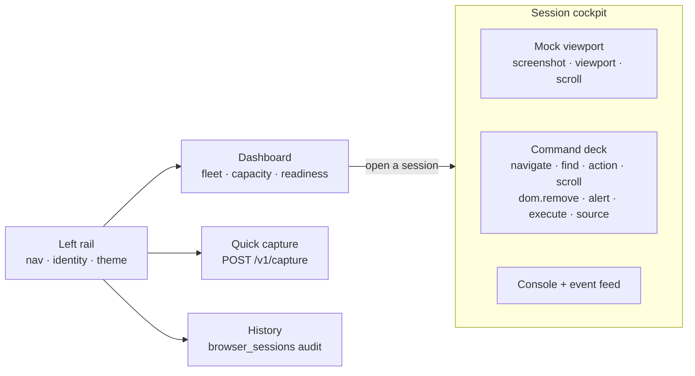

# browser-service · Operator Console (UI prototype)

An **interactive, self-contained HTML mock** of a possible operator/developer console
for browser-service. It is a **design prototype only** — everything is simulated
in-browser with mock data, and it is **not wired to the running service**. No existing
code is touched; this folder is fully isolated from the `api/` and `engine/` modules.

The service is API-first today (the README lists a live-view UI as out of MVP scope),
so this explores what such a UI could feel like. Every control is labelled with the
real endpoint or WebSocket op it would call, so the prototype doubles as an interactive
walkthrough of the `/v1` surface.

## Open it

Just open the file — no build, no server, no dependencies:

```bash
open ui-prototype/console.html        # macOS
xdg-open ui-prototype/console.html    # Linux
```

It renders in light or dark; use the theme toggle in the lower-left rail (it also
honours your OS `prefers-color-scheme`).

## What you can do

- **Dashboard** — the session fleet: live TTL countdown rings, a capacity meter (hit the
  10-session cap to see the `429 session_cap_exceeded` path), a create-session flow, and
  an upstream-readiness strip. Sessions reap themselves on idle/absolute TTL in real time.
- **Session cockpit** — drive one browser live: a mock viewport (with screenshot
  strategies), Navigate, Find element (resolves a handle + attributes + rect and
  highlights the node), Element action / mobile touch, Scroll, DOM-overlay removal,
  Alerts, Execute JS, and Get source — plus a request/response console and a pushed
  event feed (`alert.appeared`, `console.log`, `navigation.changed`).
- **Quick capture** — the one-shot `POST /v1/capture` flow with a rendered result and the
  `CaptureResponse` shape.
- **History** — the `browser_sessions` audit trail with close reasons.

## View map



## Mapping to the real API

| Console control | Endpoint / WS op |
|---|---|
| New session · fleet list | `POST /v1/sessions` · `GET /v1/sessions` |
| Close session | `DELETE /v1/sessions/{id}` |
| Navigate | `POST /v1/sessions/{id}/navigate` |
| Find element | `POST /v1/sessions/{id}/element/find` |
| Element action / touch | `POST /v1/sessions/{id}/element/action` · `/element/touch` |
| Screenshot | `POST /v1/sessions/{id}/screenshot` |
| Scroll · viewport | `POST /v1/sessions/{id}/scroll` · `GET /v1/sessions/{id}/viewport` |
| Remove overlay | `POST /v1/sessions/{id}/dom/remove` |
| Alert detect / respond | `GET /v1/sessions/{id}/alert` · `POST /v1/sessions/{id}/alert/respond` |
| Execute JS · source | `POST /v1/sessions/{id}/execute` · `GET /v1/sessions/{id}/source` |
| Quick capture | `POST /v1/capture` |
| Readiness strip | `GET /readyz` |
| Event feed | WebSocket `/v1/ws/sessions` push events |

## Implementation notes

- One file, ~1.1k lines, no external assets — inline CSS + vanilla JS, so it satisfies a
  strict CSP and works offline or as a hosted artifact.
- Theme-aware via CSS custom properties: `prefers-color-scheme` for the default plus a
  `data-theme` override the in-page toggle stamps on `:root`.
- Simulated clock drives the TTL countdowns and idle/absolute reaping; new sessions can be
  opened with a short 60s idle TTL to watch a reap happen quickly.
